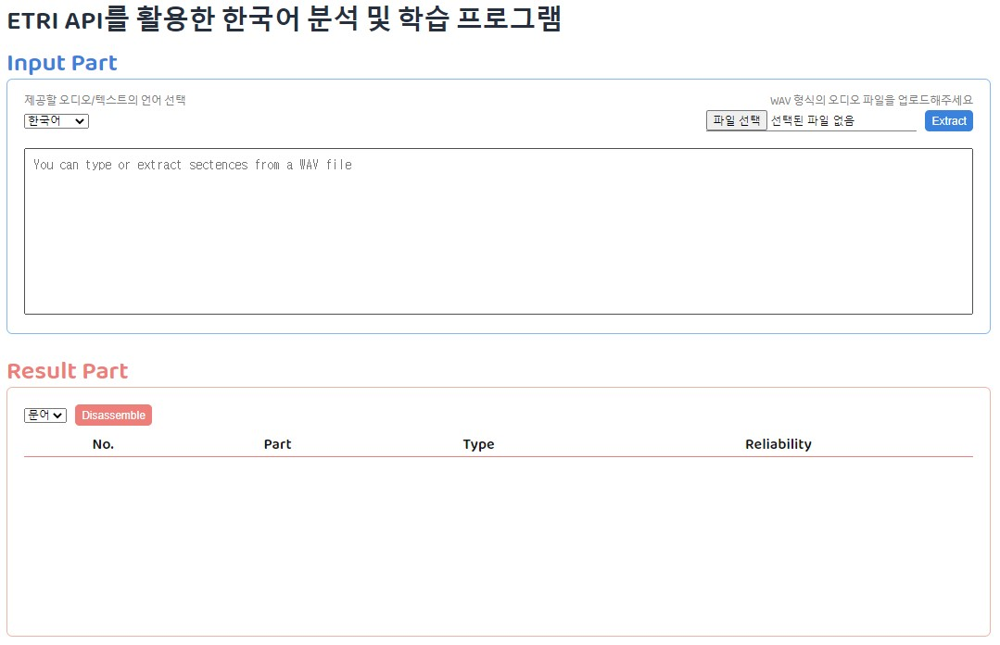
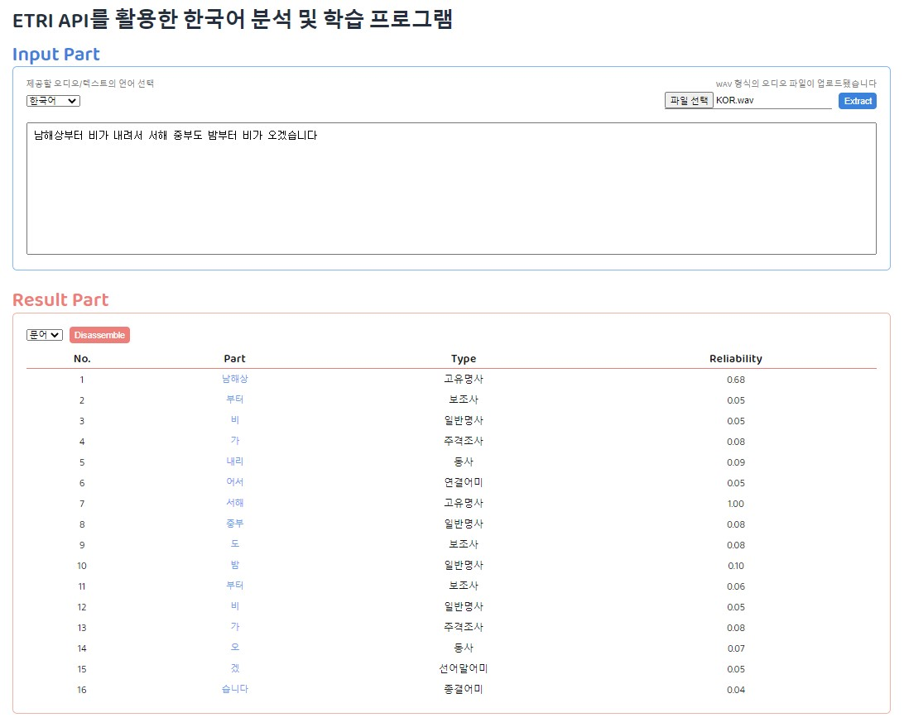
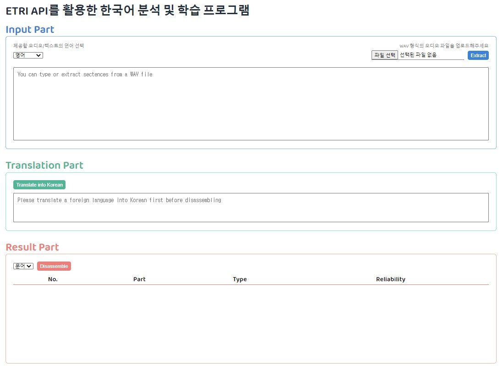
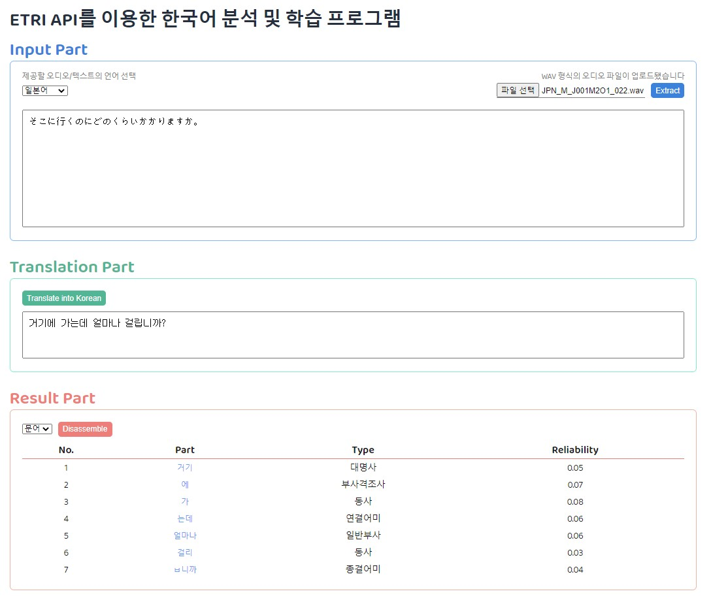
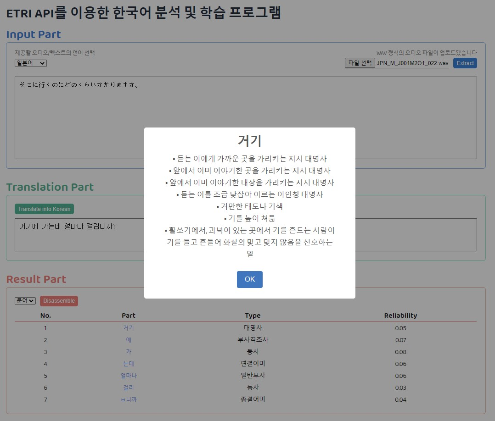

# ETRI API를 활용한 한국어 분석 및 학습 프로그램

[ETRI API](http://aiopen.etri.re.kr/service_list.php)

사용자는 음성 파일 업로드 / 텍스트 입력을 통해 분석하고 싶은 문장을 제공한다.

입력된 문장이 한국어가 아닐 경우, 한국어로 번역한 후 해당 문장을 분석한다.

분석된 각 단어들의 정의에 대한 설명을 제공한다.

## 실행 화면

🔽 Input 언어가 한국어 일 때

🔽 결과 화면

🔽 Input 언어가 외국어 일 때

🔽 결과 화면

🔽 단어 정의 팝업 화면

## 1.

한국어, 영어, 일본어, 중국어, 스페인어, 프랑스어, 독일어, 러시아어, 베트남어 총 9개의 언어 중 하나의 오디오 파일를 업로드하여 음성인식 API를 통해 오디오의 말을 텍스트로 추출한다.

[음성 인식 API](http://aiopen.etri.re.kr/guide_recognition.php)

## 2.

추출한 텍스트 혹은 입력한 텍스트가 외국어일 경우 이를 한국어로 번역할 수 있다.

[파파고 번역 API](https://developers.naver.com/docs/papago/papago-nmt-overview.md)

## 3.

입력된 혹은 번역된 한국어 문장을 언어분석 API를 통해 형태소 단위로 분석할 수 있다. 분석된 각 단어들의 정의(동음이의어 포함)에 대한 설명을 제공한다.

[언어 분석 API](http://aiopen.etri.re.kr/guide_wiseNLU.php)

[어휘 정보 API](http://aiopen.etri.re.kr/guide_word.php)
